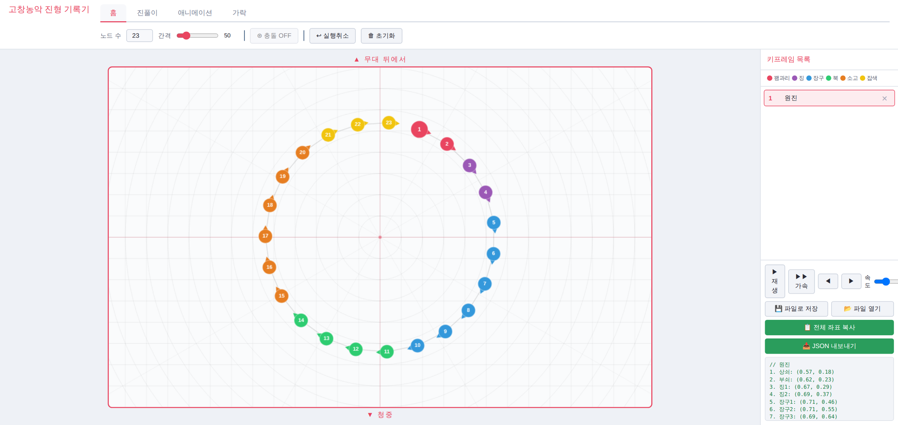
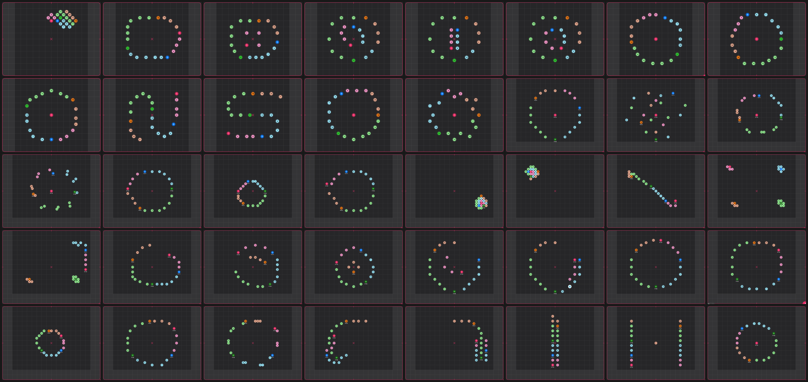

# Nongak Formations

고창농악 판굿의 진형(대형)과 진형 사이의 이동을 좌표로 기록하고 재생하는 브라우저 도구.

**Live demo** → https://limdoyun0603.github.io/nongak-formations/ (설치 없이 브라우저에서 열림)

<!-- 도구 화면 캡처를 받으면 아래 줄의 주석을 풀 것 -->
<!--  -->

---

## 무엇을 하는가

- 상쇠(맨 앞 사람)를 끌면 나머지가 한 줄로 뒤따라온다. 사람을 한 명씩 옮기지 않는다.
- 원을 그리면 원진으로 정리되고, 버튼으로 난진·11자진·반연풍 등을 만든다.
- 끌면서 녹화하면 움직임이 실제 속도로 기록되고, `.json` 파일로 저장해 다시 열고 재생할 수 있다.

## 왜 만들었나

2025년 연세대 중앙 풍물패 '떼' 정기공연을 연출하며 판굿 진형 13종을 새로 짰다. 기록에는 안무 앱 ArrangeUs를 썼는데, 무용·치어리딩용이라 사람 위치를 한 명씩 지정해야 했다. 진형이 바뀌는 과정을 보여주려면 장면마다 슬라이드를 새로 만들어야 했고, 슬라이드는 수백 장이 됐다. 동선 하나를 고치면 뒤따르는 슬라이드를 처음부터 다시 그렸다.

*2025년 공연 기획서에 실은 대형도 40장. 한 장마다 사람 위치를 하나씩 찍었다.*

풍물의 진형은 개별 위치의 나열이 아니다. 상쇠가 길을 내고 나머지가 그 궤적을 따라간다. 이 원리를 편집 방식으로 옮기면 작업량이 줄어든다고 보고 만들었다.

## 데이터

`formations/`에 진형 6종을 JSON으로 정리했다. 각 파일에는 이름, 출처(어느 마당의 어느 가락에서 쓰는지), 기하 파라미터, 규칙, 변형, 구현 상태, 좌표가 들어 있다.

좌표만이 아니라 규칙도 기록한다. 예를 들어 "한 번의 태극진은 원진의 회전 방향을 뒤집는다"는 규칙은 좌표에 드러나지 않지만 다음 진형을 결정한다. 난진(매번 달라야 함)과 장사진(상쇠의 즉흥 동선)은 좌표를 고정할 수 없어 배치 규칙만 적었다.

판굿 구조, 마당별 진형과 가락, 용어는 [OVERVIEW.md](./OVERVIEW.md)에 있다.

도구에서 💾 파일로 저장하면 녹화한 동작, 키프레임, 현재 진형, 끊어 둔 체인이 `.json` 하나로 저장된다. 한 사람의 상태는 `[x, y, 방향(라디안), 떨어짐(0/1), 앉음(0/1)]`로 기록한다.

## 구현 상태

| 진형 | 도구에서 | 출처 |
|------|------|------|
| 원진 | ✅ 원을 그리면 자동 정리 | 모든 마당의 기본 |
| 11자진 | ✅ 버튼 + 방향 지정 | 2마당, 3마당 |
| 난진 | ✅ 버튼 | 어름굿 |
| 장사진 | ✅ 기본 동작(뱀 따라가기)으로 표현 | 입장굿, 3마당 |
| 태극진 | 🔧 알고리즘만 코드에 있음 (버튼 없음) | 1·2·3마당 |
| 달팽이진 | 📝 문서화만 | 2마당 |

## 사용법

1. **동선** — 1번(상쇠)이나 마지막 사람을 드래그. 원을 그리면 원진으로 정리됨
2. **진형** — 진풀이 탭의 ⁂ 난진, ‖ 11자진, ↻ 반연풍 등
3. **녹화** — 애니메이션 탭의 ⏺ 녹화를 누르고 드래그. 다시 누르면 중지
4. **저장** — 💾 파일로 저장. 📂 파일 열기로 이어서 작업
5. **재생** — ▶ 재생

## 만든 방식

둘 다 개발자가 아니다. 코드는 배우진이 Claude(Anthropic)와 대화하며 작성했고, 임도윤이 진형 규칙을 정의하고 결과를 검수했다.

처음에는 진형을 말로 설명했지만 원하는 배치가 나오지 않았다. 그래서 도구 안에서 진형을 직접 그리고, 그때 찍힌 좌표를 Claude에게 다시 넘기는 방식으로 바꿨다. 도구가 기록 수단이면서 요구사항을 전달하는 형식이 됐다.

작업이 여러 대화에 걸치면서 앞에서 정한 것이 잊히는 문제가 생겨, [OVERVIEW.md](./OVERVIEW.md)를 새 대화가 프로젝트를 이어받기 위한 인계 문서로 만들었다. 용어 정의, 설계 원칙, 직접 그린 프레임과 Claude가 계산한 프레임이 충돌할 때의 우선순위, 하지 말아야 할 것을 적어 둔다.

2026년 2월에 구상하고 3월부터 작업했다. 레포는 7월에 만들었기 때문에 그 이전 작업은 커밋 이력에 없다.

## 설계 원칙

- **직접 그린 것이 우선** — 사람이 만든 프레임을 자동 계산으로 덮어쓰지 않는다. 수학적으로 고른 곡선과 실제 연습에서 나온 동선은 다르다.
- **태극진은 버튼으로 만들지 않는다** — 고정된 모양이 아니라 상쇠의 S자 궤적을 따라가며 나타나는 진형이기 때문이다.
- **머신러닝은 쓰지 않는다** — 학습할 진형 데이터가 부족하고, 무엇을 예측할지 아직 정의되지 않았다.
- **단일 HTML 파일, 저장은 파일로만** — 둘 다 코드를 관리해 본 적이 없어 파일 하나로 시작했다. 처음 작업한 Claude.ai 환경이 브라우저 저장소를 지원하지 않아 파일로 저장하는 방식을 택했고, GitHub Pages로 옮긴 지금도 그대로 쓴다.

## 한계

- 태극진은 버튼이 없고, 달팽이진은 도구에 없다.
- 11자진은 원진에서 접는 방식만 된다. 일자진에서 좌우로 갈라지는 방식은 아직 없다.
- 진형 데이터는 고창농악 기준이다. 다른 지역 풍물에는 그대로 맞지 않는다.
- 좌표는 화면 기준 상대값이다. 실제 공연장 치수로 바꾸는 기능은 없다.
- 마당별 가락과 BPM 목록은 있지만, 녹화한 동작이 박자에 맞춰 기록되지는 않는다.

## 다음 작업

- 판굿 한 마당을 처음부터 끝까지 이 도구로 기록해 보기 (입장굿 진행 중)
- 박자 기록: 한 프레임을 반 장단으로 두는 방식 (설계만 해 둠)
- "원진 → 태극진 → 원진" 같은 문장을 받아 기존 기능을 순서대로 실행하는 방식 (구상 단계). 공개된 정적 페이지라 API 키를 넣을 수 없어, 외부 AI 연동은 보류했다.

## 만든 사람

- 임도윤 ([@limdoyun0603](https://github.com/limdoyun0603)) — 진형 규칙·데이터 정의, 설계 판단, 검수
- 배우진 ([@nestor-pylos](https://github.com/nestor-pylos)) — 도구 구현

코드 작성에 Claude를 사용했다. 커밋 작성자가 Claude로 표시되는 것은 이 때문이다. 두 사람은 연세대 중앙 풍물패 '떼'에서 함께 활동했다.

## 라이선스

MIT — [LICENSE](./LICENSE)

---

**English summary** — A browser tool for recording and replaying the formations of Gochang Nongak, a Korean traditional percussion performance. Drag the lead player and the rest follow as a chain; record movements and save them as JSON. Formation rules, not just coordinates, are documented in `formations/`. Built by two non-developers: @limdoyun0603 (domain rules, review) and @nestor-pylos (implementation, written with Claude).
